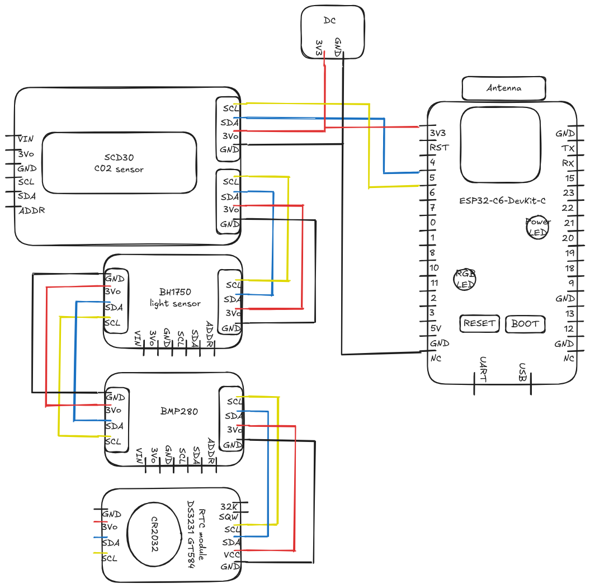
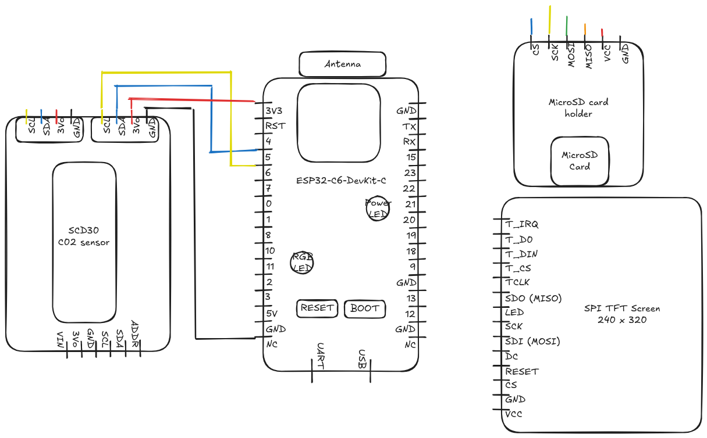
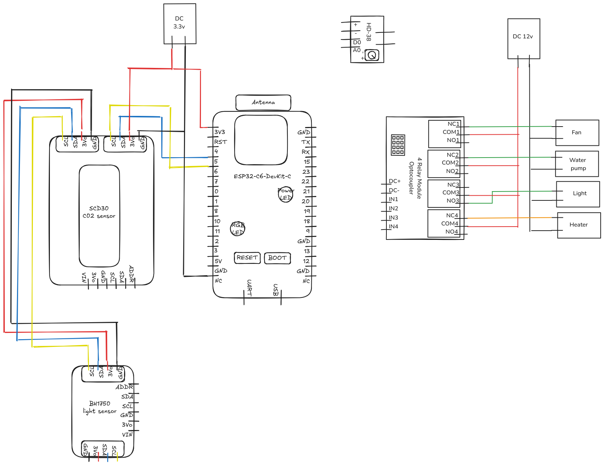

# AutomatedGreenHouse

Automated Green House system.
Hobby project to practice various technics in electronic and IoT.


## Structure of the project

There are different modules :
 - Outdoor module : measure outdoor conditions, act as a weather station.
 - Indoor module : inside the building, idealy close to greenhouse.
    - monitor indoor conditions to compare with local conditions. 
    - Data logger
    - Display on a screen.
 - Local module : inside the greenhouse
    - Monitor local environnemental condition
    - Control actuators (water pump, heater, fan) to maintain defined conditions.

Wireless communication between module, data will be logged for Machine learning analysis.


## Components used for all modules

- ESP32-C6-DevKit C1
    - System on a Chip (SoC)
    - 32-bit RISC-V processor (160 MHz) + low-power 32-bit RISC-V processor (20 MHz).
    - Wifi 6/ Bluethooth 5 / Zigbee communication protocols
    - 22 programmable GPIOs, with support for SPI, UART, I2C, I2S, RMT, TWAI, PWM, SDIO, Motor Control PWM.
    - [Technical sheet on manufacturer website](https://www.espressif.com/en/products/socs/esp32-c6)
- BMP280 :
    - Pressure sensor from 300 to 1 100 hPa  
    - Temperature measurement for more accurate results from -40 to + 85 °C
    - [Technical sheet on manufacturer website](https://www.bosch-sensortec.com/products/environmental-sensors/pressure-sensors/bmp280/)
- SCD30 :
    - NDIR technology for accurate CO2 readings from 400 to 10,000 ppm
    - Measure temperature and relative humidity for more accurate measure
    - Local altitude compensation in the setup function for more accurate measure
    - [Link to the manufacturer website](https://sensirion.com/products/catalog/SCD30)
- DS3231 GT584:
    - Give accurate date & time (secondes, minutes, hours) and date (day, month, year, day of the week)
    - Leap-Year Compensation Valid Up to 2100
    - Crystal oscillator is temperature compensated (TCXO) for more accurate measures
    - Battery is a common CR2032
    - [Link to the DS3231 Data Sheet](https://www.analog.com/media/en/technical-documentation/data-sheets/ds3231.pdf)
- BH1750
    - 16-bit Ambient Light sensor from Rohm.
    - light measurements in lux, with a range from from 0 to 65K+ lux (Even 100,000 lux with calibration & advanced adjustements)
    - [Link to Adafruit Product page](https://learn.adafruit.com/adafruit-bh1750-ambient-light-sensor/overview)
- HD38 soil humidity sensor
    - Basic sensor that detect the moisture content of the soil
    - Can work on analog or digital mode
- SPI MicroSD card holder + microSD card
    - SPI Interface
- TFT LCD screen 240x320 pixels
    - SPI Interface
    - [Link to the DS3231 Data Sheet](https://cdn-shop.adafruit.com/datasheets/ILI9341.pdf)
- Kamoer KPHM100-HBB10-EU
    - Peristatlic water Pump
    - Flow rate : 90 ml / min
    - Power draw (Manufacturer data) : 6w
    - [Link to the manufacturer website](https://www.kamoer.com/us/product/params.html?id=10021)
- Peltier modules TEC1 12715
    - 12-15.4 volts, 15 amps (Might be overkill, to be confirmed)
    - Number of module to be defined (1 to 4)
- Arctic P12 120mm fan
    - [Link to Arctic Product page](https://www.arctic.de/en/P12/ACFAN00118A)


**Power inputs**
- All sensors are working on 3.3 volts
- All actuators are working on 12 volts


## Outdoor Module

### Roadmap for this module

- Add Zigbee or LoRa communication
- Add a case for outdoor conditions


### Functionalities

- Measures are done every minute
- Measures : 
    - CO2
    - Atmospheric pressure
    - Temperature
    - Air relative humidity
    - Light
- Results are send to Local module using Zigbee or LoRa for data logging

### Components

- ESP32-C6-DevKit C1
- SCD30
- BMP280
- BH1750
- DS3231
- LoRa module ?

### Electronic diagram

Interface used : I²C



### IDE & Librairies

Developed on Arduino IDE 2.3.6

Librairies required : 
 - for I2C interface : Wire.h
 - for SCD30 : SparkFun_SCD30_Arduino_Library.h
 - for DS3231 : RTClib.h
 - for BMP280 : Adafruit_BMP280.h
 - for BH1750 : BH1750.h and Adafruit_Sensor.h


### Example of Serial Monitor output

```
23:14:03.443 -> ESP-ROM:esp32c6-20220919
23:14:03.443 -> Build:Sep 19 2022
23:14:03.443 -> rst:0x1 (POWERON),boot:0x2c (SPI_FAST_FLASH_BOOT)
23:14:03.443 -> SPIWP:0xee
23:14:03.443 -> mode:DIO, clock div:2
23:14:03.443 -> load:0x40875720,len:0x1228
23:14:03.474 -> load:0x4086c110,len:0xd9c
23:14:03.474 -> load:0x4086e610,len:0x2f74
23:14:03.474 -> entry 0x4086c110
23:14:03.538 -> Outdoor Module - Environmental Monitoring System
23:14:03.538 -> RTC initialized!
23:14:03.667 -> BMP280 sensor initialized!
23:14:03.667 -> SCD30 sensor initialized!
23:14:03.699 -> BH1750 sensor initialized!
23:14:03.699 -> All sensors ready!
23:14:03.699 -> Taking measurements every 60 seconds...
23:14:03.699 -> 
23:14:03.699 -> ==== New Measurement ====
23:14:03.699 -> Timestamp: 2025-05-03 23:13:42
23:14:03.730 -> --- BMP280 Data ---
23:14:03.730 -> Temperature: 26.85 °C
23:14:03.730 -> Pressure: 1003.60 hPa
23:14:03.730 -> Approx. Altitude: 80.64 m
23:14:03.730 -> --- SCD30 Data ---
23:14:03.730 -> CO2: 719.00 ppm
23:14:03.763 -> Temperature: 28.05 °C
23:14:03.763 -> Humidity: 52.11 %
23:14:03.763 -> --- BH1750 Data ---
23:14:03.763 -> Light: 45.83 lux
23:14:03.763 -> --- RTC Data ---
23:14:03.763 -> RTC Temperature: 26.00 °C
23:14:03.763 -> 
```


## Indoor module 

### Roadmap for this module

- Add SD Card support
- Add screen support
- Add Zigbee or LoRa communication


### Functionalities

- Measures are done every minute
- Measures : 
    - CO2
    - Temperature
    - Air Relative humidity
- Log data in a MicroSD card
- Display data on a screen

### Components

- ESP32-C6-DevKit C1
- SCD30
- DS3231
- MicroSD card holder + MicroSD card
- TFT screen 240x320 pixels
- LoRa module ?

### Electronic diagram

Interface used : I²C and SPI



### IDE & Librairies

Developed on Arduino IDE 2.3.6

Librairies required : 
 - for I2C interface : Wire.h
 - for SCD30 : SparkFun_SCD30_Arduino_Library.h
 - for DS3231 : RTClib.h

### Example of Serial Monitor output

```
11:22:04.167 -> ESP-ROM:esp32c6-20220919
11:22:04.167 -> Build:Sep 19 2022
11:22:04.167 -> rst:0x1 (POWERON),boot:0x1f (SPI_FAST_FLASH_BOOT)
11:22:04.198 -> SPIWP:0xee
11:22:04.198 -> mode:DIO, clock div:2
11:22:04.198 -> load:0x40875720,len:0x1228
11:22:04.198 -> load:0x4086c110,len:0xd9c
11:22:04.198 -> load:0x4086e610,len:0x2f74
11:22:04.198 -> entry 0x4086c110
11:22:04.263 -> Environmental Monitoring System - Indoor Module
11:22:04.263 -> RTC initialized!
11:22:04.263 -> SCD30 sensor initialized!
11:22:04.295 -> All sensors ready!
11:22:04.295 -> Taking measurements every 60 seconds...
11:22:04.295 -> 
11:22:04.295 -> ==== New Measurement ====
11:22:04.295 -> Timestamp: 2025-05-11 11:12:28
11:22:04.327 -> --- SCD30 Data ---
11:22:04.327 -> CO2: 580.00 ppm
11:22:04.327 -> Temperature: 24.79 °C
11:22:04.327 -> Relative Humidity: 46.51 %
11:22:04.327 -> --- RTC Data ---
11:22:04.327 -> RTC Temperature: 22.50 °C
11:22:04.327 -> 
```


## Local module


### Roadmap for this module

- Add 4 Channels relais
    - Water pump
    - Fan
    - Peltiers modules
- Add HD38 sensor
- Add Zigbee or LoRa communication


### Functionalities

- Measures are done every minute
- Sensors : 
    - Measure CO2
    - Temperature
    - Soil humidity
    - Air relative humidity
    - light
- Actuators :
    - Water pump
    - Ventilation
    - Temperature control
- Communication:
    - Zigbee or LoRa communication


### Components

- SoC (3.3v):
    - ESP32-C6-DevKit C1
- Sensors (3.3v):
    - SCD30
    - BH1750
    - HD38
    - DS3231 GT584
- Actuators (12v):
    - 4 Channels relais
    - Arctic P12 120mm fan
    - Kamoer Peristatlic water Pump
    - Peltiers modules (1 to 4, to be defined)
- Power :
    - 12 volts power brick
    - 12 to 3.3 volts converter  
- Communication:
    - LoRa module ?

### Electronic diagram

Interface used : I²C



### IDE & Librairies

Developed on Arduino IDE 2.3.6

Librairies required : 
 - for I2C interface : Wire.h
 - for SCD30 : SparkFun_SCD30_Arduino_Library.h
 - for DS3231 : RTClib.h
 - for BH1750 : BH1750.h and Adafruit_Sensor.h


### Example of Serial Monitor output

```
10:42:28.571 -> rst:0x1 (POWERON),boot:0x7f (SPI_FAST_FLASH_BOOT)
10:42:28.603 -> SPIWP:0xee
10:42:28.603 -> mode:DIO, clock div:2
10:42:28.603 -> load:0x40875720,len:0x1228
10:42:28.603 -> load:0x4086c110,len:0xd9c
10:42:28.603 -> load:0x4086e610,len:0x2f74
10:42:28.603 -> entry 0x4086c110
10:42:28.668 -> Environmental Monitoring System - Local Module
10:42:28.668 -> RTC initialized!
10:42:28.668 -> SCD30 sensor initialized!
10:42:28.733 -> BH1750 sensor initialized!
10:42:28.733 -> All sensors ready!
10:42:28.733 -> Taking measurements every 60 seconds...
10:42:28.733 -> 
10:42:28.733 -> ==== New Measurement ====
10:42:28.733 -> Timestamp: 2025-05-04 10:42:28
10:42:28.765 -> --- SCD30 Data ---
10:42:28.765 -> CO2: 1357.00 ppm
10:42:28.765 -> Temperature: 25.29 °C
10:42:28.765 -> Humidity: 37.51 %
10:42:28.765 -> --- BH1750 Data ---
10:42:28.765 -> Light: 612.50 lux
10:42:28.765 -> --- RTC Data ---
10:42:28.765 -> RTC Temperature: 24.25 °C
10:42:28.765 -> 
```